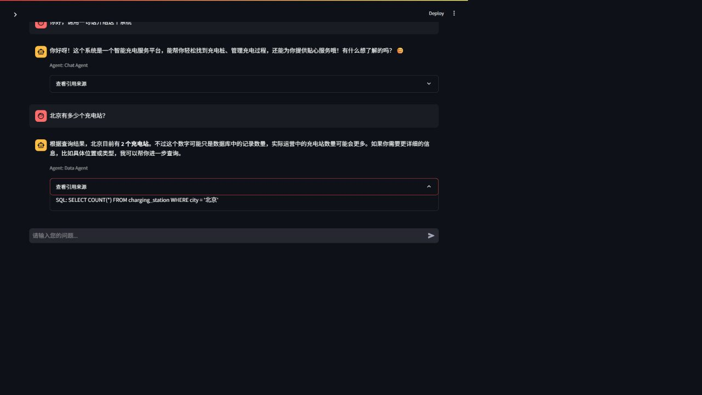
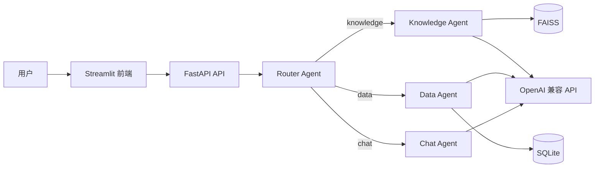
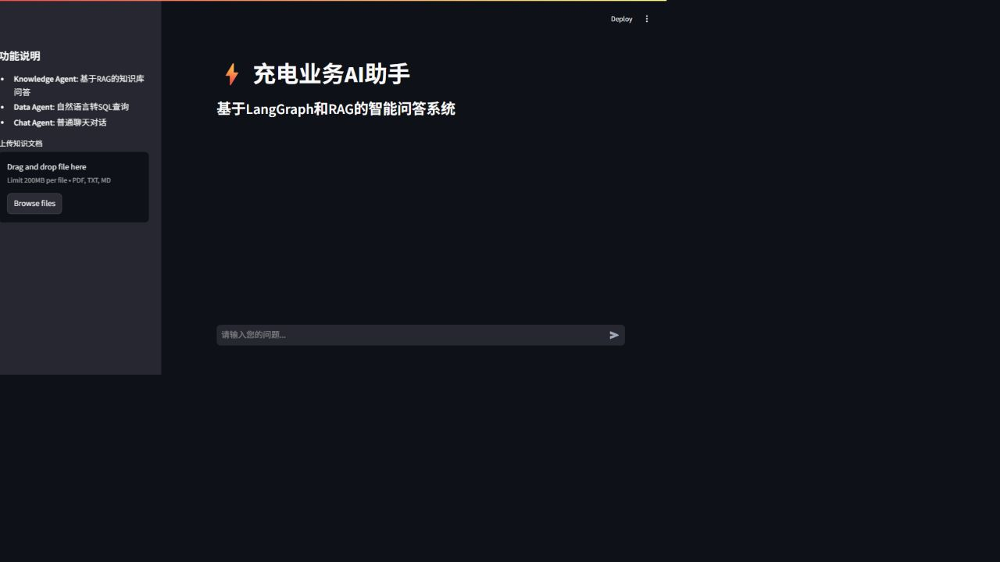
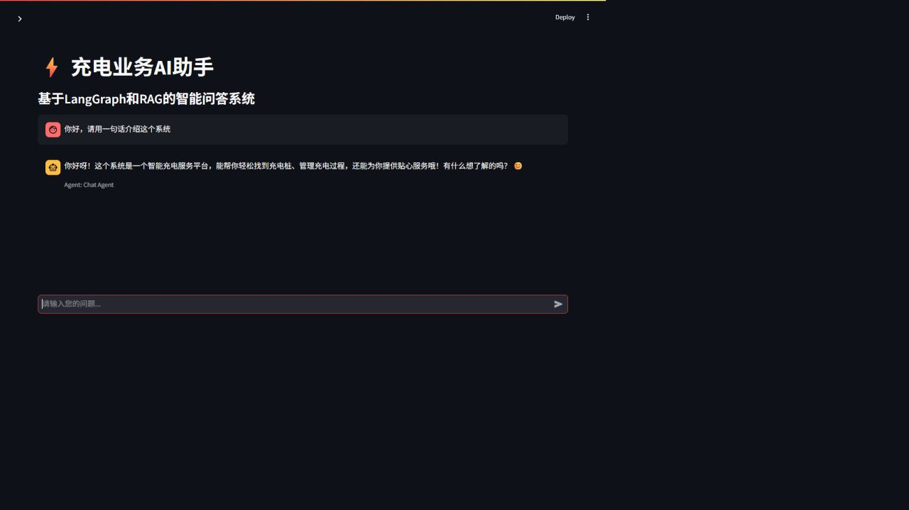
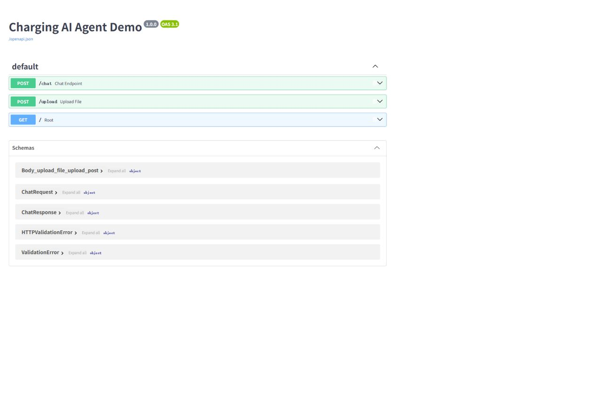

# ⚡ Charging AI Agent Demo

基于 **LangGraph + RAG + NL-to-SQL** 的充电业务智能助手。项目使用 FastAPI 提供 API、Streamlit 提供聊天界面，并通过 Router Agent 将问题分发给知识问答、数据分析或通用对话 Agent。

<p align="center">
  
</p>

## 核心能力

| 能力 | 说明 |
| --- | --- |
| Multi-Agent 路由 | LangGraph 根据问题类型选择 Knowledge、Data 或 Chat Agent |
| RAG 知识问答 | 文档解析、切片、Embedding、FAISS 检索、引用来源返回 |
| NL-to-SQL | 将自然语言转换为只读 SQL，查询 SQLite 充电业务数据 |
| 文档上传 | 支持 PDF、TXT、Markdown 文档并写入向量库 |
| Web 交互 | Streamlit 聊天界面、会话记录、Agent 标识和来源展示 |
| REST API | FastAPI 提供聊天、上传接口及 Swagger 文档 |

## 项目亮点

- **Multi-Agent Workflow**：Router Agent 自动识别用户意图，再选择专业 Agent。
- **完整 RAG Pipeline**：覆盖上传、解析、切片、Embedding、Top-K 检索和回答生成。
- **可解释 NL-to-SQL**：返回查询结论及实际 SQL，并限制为只读查询。
- **完整应用链路**：前端、API、Agent 编排、向量库和业务数据库均可独立扩展。

## 系统架构



### Agent 分工

- **Router Agent**：识别 `knowledge`、`data`、`chat` 三类意图。
- **Knowledge Agent**：检索知识库上下文，生成带来源的业务回答。
- **Data Agent**：生成并执行只读 SQL，再将结果整理为自然语言。
- **Chat Agent**：处理普通聊天和非业务问题。

## 运行截图

### 应用首页



### 真实 AI 对话



### NL-to-SQL 数据查询


### FastAPI 接口文档



## 快速开始

### 环境要求

- Python 3.11
- Windows 10/11，或可运行 Python 的 macOS / Linux
- OpenAI 兼容 API Key

### Windows 一键启动

```bat
git clone https://github.com/LMY05/charging-ai-agent-demo.git
cd charging-ai-agent-demo
init.bat
copy .env.example .env
```

编辑 `.env` 后启动：

```bat
start.bat
```

访问地址：

- Web 界面：<http://localhost:8501>
- API 文档：<http://localhost:8000/docs>
- API 根地址：<http://localhost:8000>

### 手动启动

```powershell
python -m venv .venv
.\.venv\Scripts\Activate.ps1
pip install -r requirements.txt
python -m uvicorn backend.main:app --host 127.0.0.1 --port 8000
```

新开终端：

```powershell
.\.venv\Scripts\Activate.ps1
streamlit run frontend/app.py --server.port 8501
```

macOS / Linux 请将激活命令替换为：

```bash
source .venv/bin/activate
```

## 环境变量

复制 `.env.example` 为 `.env`，不要提交真实密钥。

```dotenv
OPENAI_API_KEY=your_api_key
OPENAI_API_BASE=https://api.openai.com/v1
OPENAI_MODEL=gpt-4o-mini
```

DeepSeek 聊天模型示例：

```dotenv
OPENAI_API_KEY=your_deepseek_api_key
OPENAI_API_BASE=https://api.deepseek.com/v1
OPENAI_MODEL=deepseek-chat
```

> DeepSeek 标准接口目前可用于 Router、Chat 和 Data Agent，但不提供本项目默认使用的 `text-embedding-3-small`。完整启用 Knowledge Agent 时，需使用支持 OpenAI Embeddings API 的服务。

## API

| 方法 | 路径 | 说明 |
| --- | --- | --- |
| `GET` | `/` | 服务状态 |
| `POST` | `/chat` | 提交问题并返回答案、Agent 和来源 |
| `POST` | `/upload` | 上传知识文档并写入向量库 |

聊天请求示例：

```bash
curl -X POST http://localhost:8000/chat \
  -H "Content-Type: application/json" \
  -d '{"message":"北京有多少个充电站？","session_id":"demo-user"}'
```

## 推荐体验问题

```text
Knowledge Agent：充电费用如何计算？
Data Agent：北京有多少个充电站？
Data Agent：最近一个月有多少充电订单？
Chat Agent：你好，请用一句话介绍这个系统。
```

## 项目结构

```text
charging-ai-agent-demo/
├── backend/
│   ├── agents/          # Router、Knowledge、Data、Chat 与 LangGraph
│   ├── config/          # 环境配置
│   ├── database/        # SQLite 表结构、连接和模拟数据
│   ├── rag/             # 文档加载、切片、Embedding、FAISS 检索
│   └── main.py          # FastAPI 入口
├── frontend/app.py      # Streamlit 前端
├── knowledge/           # 示例知识文档
├── screenshots/         # README 运行截图
├── init.bat             # Windows 环境初始化
├── start.bat            # Windows 一键启动
└── requirements.txt
```

## 技术栈

`Python 3.11` · `FastAPI` · `Streamlit` · `LangChain` · `LangGraph` · `FAISS` · `SQLite` · `SQLAlchemy`

## 安全说明

- `.env` 已被 `.gitignore` 排除；提交前仍请检查暂存文件。
- Data Agent 仅允许执行单条 `SELECT` 查询。
- 演示项目默认开放 CORS；生产部署前应限制来源并增加鉴权、限流和输入校验。

## 参与贡献

欢迎通过 [Issue](https://github.com/LMY05/charging-ai-agent-demo/issues) 或 Pull Request 提交建议与改进。
